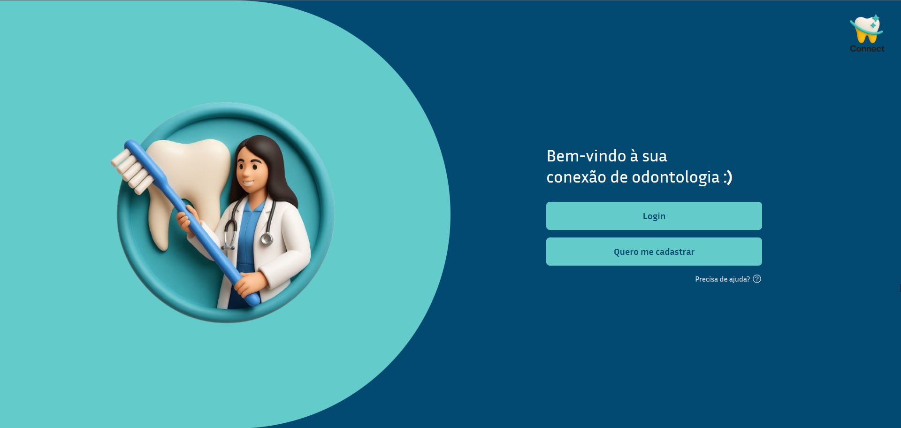
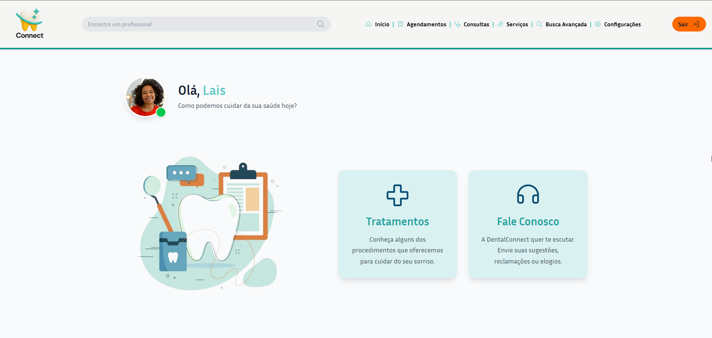
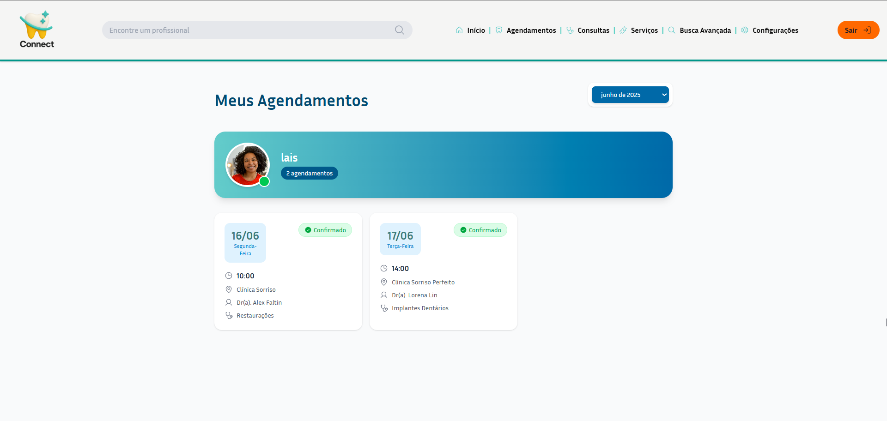
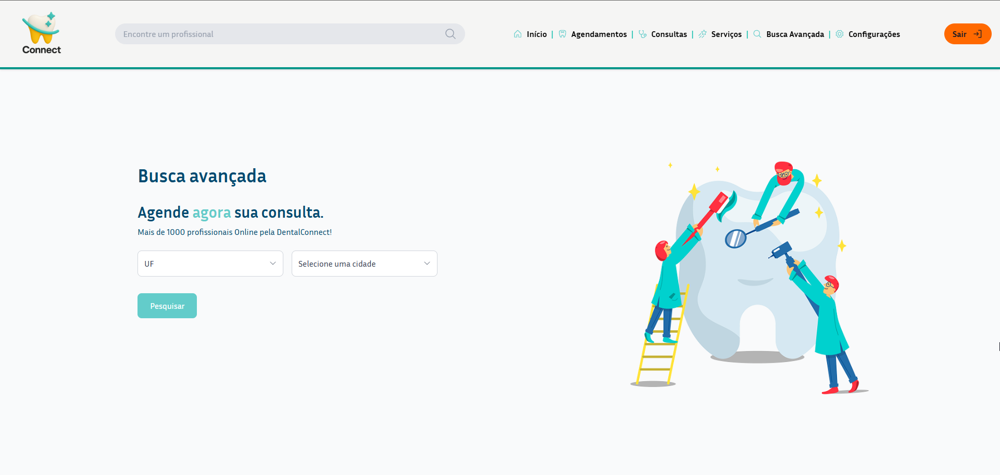

# DentalConnect 🦷 💬


<div align="center">
  
  
  
    
  
  
</div>

---

## 📝 Sobre

A **DentalConnect** é uma plataforma desenvolvida para conectar pacientes com clínicas odontológicas. A proposta é facilitar o agendamento de consultas e fornecer uma forma eficiente de interação entre pacientes e dentistas. O objetivo é tornar a experiência de encontrar e agendar consultas odontológicas mais prática e acessível.

---

## 🛠 Tecnologias

### Front-End  
- **React.js**: Framework para construção de interfaces dinâmicas.  
- **Tailwind CSS**: Framework para estilização rápida e responsiva.  
- **CSS e HTML**: Estrutura básica e personalização.  
- **Axios**: Biblioteca para realizar requisições HTTP ao backend.

### Back-End  
- **Node.js**: Ambiente de execução para JavaScript no servidor.  
- **Express.js**: Framework para construção da API.  
- **JWT (JSON Web Token)**: Sistema de autenticação para segurança dos usuários.

### Banco de Dados  
- **Supabase**: Banco de dados para armazenamento de informações dos usuários, clínicas e agendamentos.

---

## ✨ Funcionalidades

- **Cadastro de usuários**: Permite que pacientes criem suas contas na plataforma.  
- **Agendamento de consultas**: Facilita o processo de agendamento de consultas odontológicas.  
- **Autenticação segura**: Utilização de JWT para garantir a segurança das informações dos usuários.  
- **Visualização de clínicas**: Pacientes podem visualizar e filtrar clínicas disponíveis para consulta.

---

## 🚀 Como executar o projeto

### Pré-requisitos  
- Node.js instalado  
- Gerenciador de pacotes (npm ou yarn)

### Instalação

1. Clone o repositório:  
   ```bash
   git clone https://github.com/laissilva04/dentalconnect.git
2. Acesse o diretório do projeto:  
   ```bash
   cd dentalconnect
3. Instale as dependências:  
   ```bash
   npm install
4. Inicie o servidor do backend:  
   ```bash
   node index.js
5. Inicie a aplicação do frontend: 
   ```bash
   npm run dev
6. Acesse a plataforma no seu navegador em http://localhost:5173

Link para o repositório do back-end 👉: https://github.com/laissilva04/dentalconnect-backend

## 👥 Contribuidores
@laissilva04
@afgcor
@linlorena
@leticialuce
@astvri
